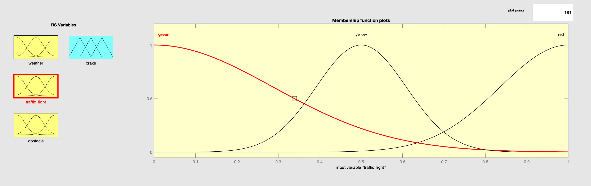
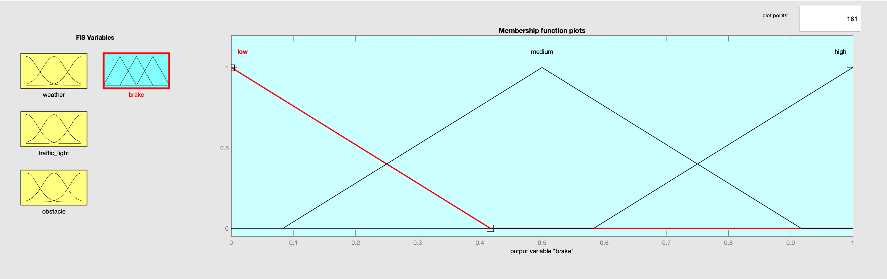
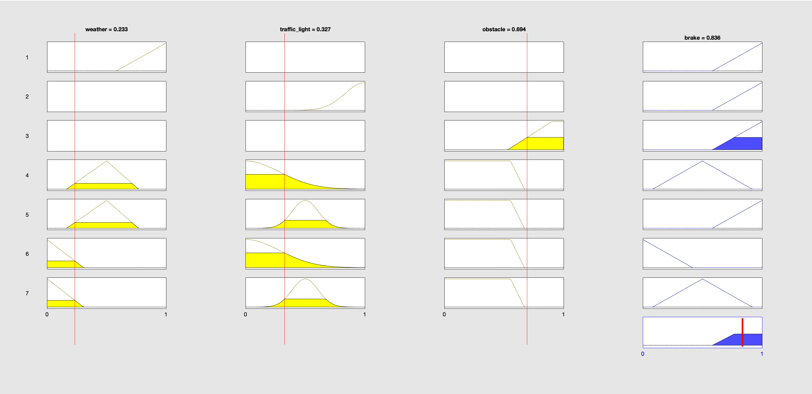
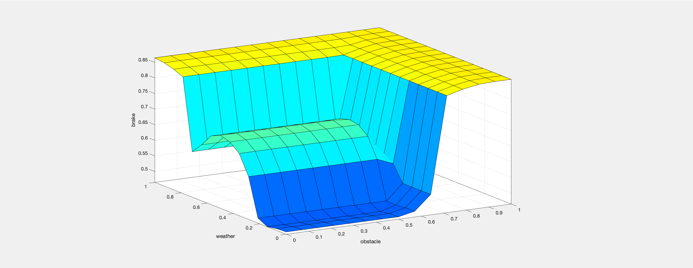
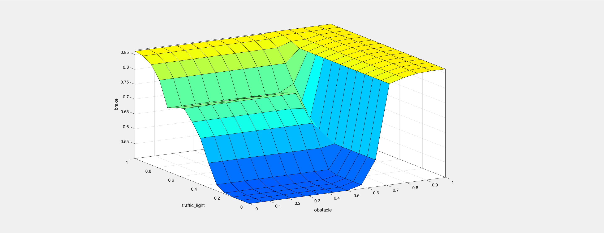

# Mamdani Fuzzy Logic System

### Implemented a Car Braking System using Fuzzy Logic in MATLAB and Python

A set of crisp inputs are taken and assigned to fuzzy sets. After that, the aggregate of the fuzzy sets are taken based on certain rules. Finally, a defuzzication step is added to obtain a crisp output as well.

#### Input Parameters:

**Visibility:** taken between a range of 0 to 1, is classified into 3 categories (sunny, rainy and hazy) based on triangular membership functions.

**Speed of Automobile:** taken between a range of 0 to 1, using a gaussian membership function, we have classified the crisp input into 3 categories based on street lights - red, yellow and green.

**Obstacles:** once again, we have normalised the values and taken it between 0 and 1, this is classified into 2 categories (absent and present) via a trapezoidal membership function.

#### Output:

**Pressure:** the amount of pressure to be applied is decided by using a triangular membership function classified into three categories - low, moderate and high.

#### Results:

